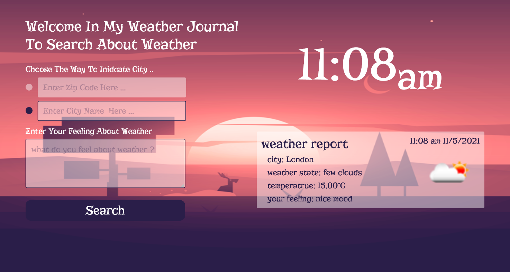

## Weather Journal App


- Author : Yossef Alatter
- Demo 

---
## Description

This is weather journal app to give user a weather report of any city he inter its name or any city in USA user enter its zipcode, it gives the user according information: ...
- date of the report 
- city name
- weather state
- temperature of the weather in the city
- the feeling the user enter

---
## Needed Software 

you must have according software
- text editor
- browser
- node.js
- npm
- git 
if you want to develop that project you will need install also nodemon by running that command
```
npm install -g nodemon
```

--- 
## Installations Steps

 ```
// to clone repo
 git clone https://github.com/yossefAlatter/weather-journal-app.git  
 
 // to move into repo
 cd weather-journal-app

// to install dependence
 npm install

 // to run nodemon for developing
 npm run dev
 // Or
 // to run node for see product
 npm run start
 ```

 ---
 ## Project Structure

 ```
 website
    css
        - style.css
    images
        - bg.webp
        - desgin.png
    js
        - main.js
    - index.html
 - .gitignore
 - package-lock.json
 - package.json
 - README.md
 - server.js
 ```

 ---

